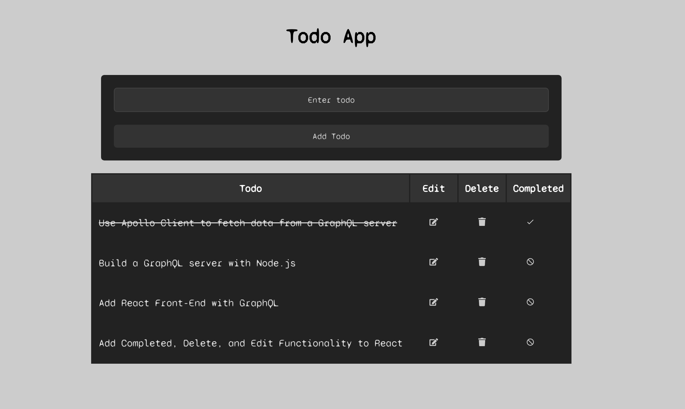

# ToDo_GraphQL
 
## Description

This GraphQL and React TODO App that allows you to create, update, and delete tasks. 

## Technologies

- React
- GraphQL
- Apollo Client
- Node.js
- Express
- MongoDB
- Mongoose

## Installation

1. Clone the repository
2. Run `npm install` in the root directory
3. Run `npm start` in the root directory
4. Navigate to `http://localhost:3000/` in your browser
5. Navigate to `http://localhost:8000/graphql` in your browser to interact with the GraphQL API

